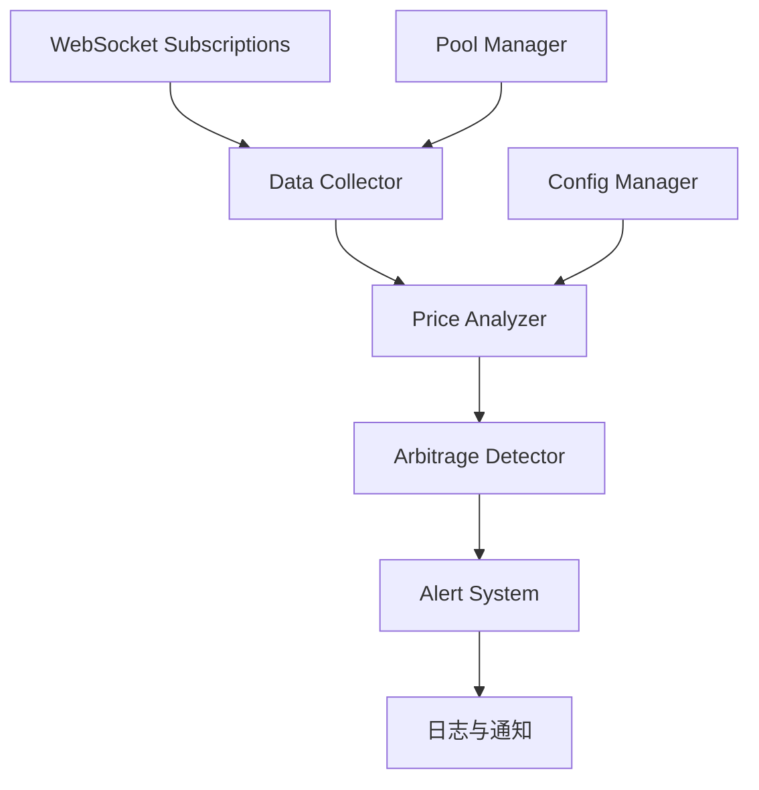
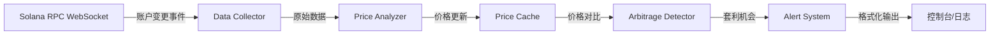

## Product Overview

基于 Python 的 Solana 链下套利监控系统，实时监控 Raydium 和 Orca 等 DEX 流动性池子价格，发现价格差异并提示套利机会。

## Core Features

- 实时监控 Raydium 和 Orca 的流动性池子价格
- 计算不同 DEX 之间的价格差
- 检测并报告套利机会
- 动态监听热门交易对池子
- 可扩展支持更多 DEX 协议

## Tech Stack

- 编程语言: Python 3.9+
- Solana 交互: solana-py, solders
- 网络请求: httpx, websockets
- 数据处理: pandas, numpy
- 日志管理: loguru

## Tech Architecture

### System Architecture

采用事件驱动架构，通过 WebSocket 实时接收链上数据，经过处理和分析后输出套利机会。



### Module Division

- **Data Collector**: 负责 WebSocket 订阅和原始数据接收
- **Pool Manager**: 管理监控的流动性池子列表
- **Price Analyzer**: 解析交易数据和计算实时价格
- **Arbitrage Detector**: 比较不同 DEX 价格，检测套利机会
- **Alert System**: 输出套利机会和告警
- **Config Manager**: 管理配置和参数

### Data Flow



## Implementation Details

### Core Directory Structure

```
project-root/
├── src/
│   ├── collectors/       # 数据收集模块
│   │   ├── __init__.py
│   │   └── ws_client.py  # WebSocket 客户端
│   ├── analyzers/        # 价格分析模块
│   │   ├── __init__.py
│   │   └── price.py      # 价格计算逻辑
│   ├── detectors/        # 套利检测模块
│   │   ├── __init__.py
│   │   └── arbitrage.py  # 套利机会检测
│   ├── models/           # 数据模型
│   │   ├── __init__.py
│   │   ├── pool.py       # 流动性池模型
│   │   └── arbitrage.py  # 套利机会模型
│   ├── managers/         # 管理器模块
│   │   ├── __init__.py
│   │   └── pool_manager.py
│   ├── utils/            # 工具函数
│   │   ├── __init__.py
│   │   └── helpers.py
│   └── main.py           # 主程序入口
├── config/               # 配置文件
│   └── config.yaml
├── logs/                 # 日志目录
├── requirements.txt
└── README.md
```

### Key Code Structures

**LiquidityPool Interface**: 流动性池数据模型

```python
from dataclasses import dataclass
from typing import Optional
from solders.pubkey import Pubkey

@dataclass
class LiquidityPool:
    """流动性池数据模型"""
    address: Pubkey
    dex: str  # 'raydium' or 'orca'
    token_a: Pubkey
    token_b: Pubkey
    reserve_a: int
    reserve_b: int
    last_update: float
    fee_rate: float
```

**ArbitrageOpportunity Interface**: 套利机会数据模型

```python
@dataclass
class ArbitrageOpportunity:
    """套利机会数据模型"""
    token_pair: tuple[str, str]
    buy_dex: str
    sell_dex: str
    buy_price: float
    sell_price: float
    price_diff_pct: float
    profit_estimate: float
    timestamp: float
```

### Technical Implementation Plan

**1. 数据收集与订阅**

- 使用 solana-py 建立 WebSocket 连接
- 订阅 Raydium 和 Orca 流动性池账户变更
- 实现账户数据解码逻辑

**2. 价格计算与更新**

- 实现恒定乘积公式 (x * y = k) 计算价格
- 考虑交易手续费的影响
- 实现价格缓存机制

**3. 套利检测逻辑**

- 同一交易对在不同 DEX 的价格对比
- 计算价格差百分比
- 设置最小套利阈值过滤噪音

**4. 热门池子动态监听**

- 实现基于交易量的池子热度算法
- 动态添加/移除监控池子
- 支持白名单和黑名单配置

### Integration Points

- **Solana RPC**: 使用公共 RPC 节点 (如 GenesysGo, Helius)
- **DEX 集成**: 
- Raydium: 解析流动性池账户布局
- Orca: 使用 Whirlpool SDK 或直接解析账户
- **数据格式**: JSON 配置文件, Python 字典传递数据

## Technical Considerations

### Logging

- 使用 loguru 实现结构化日志
- 记录价格更新、套利事件、错误信息
- 支持日志轮转和级别控制

### Performance Optimization

- 使用异步 I/O (asyncio) 处理多个 WebSocket 连接
- 实现数据去重，避免重复计算
- 价格缓存使用内存数据结构，减少计算开销

### Security Measures

- RPC endpoint 配置管理，避免硬编码
- 输入验证：检查池子地址有效性
- 错误处理：网络异常、数据解析异常的容错机制

### Scalability

- 模块化设计便于添加新 DEX 支持
- 配置驱动的池子管理
- 支持分布式部署（消息队列分离）

## Agent Extensions

### SubAgent

- **code-explorer**
- Purpose: 探索现有项目目录结构和已有代码
- Expected outcome: 确认项目当前状态，了解是否已有相关代码实现