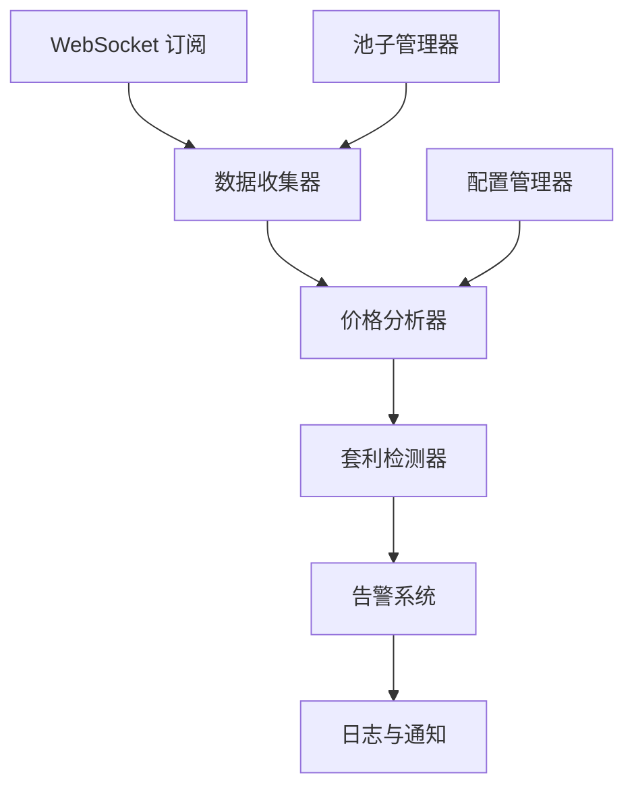
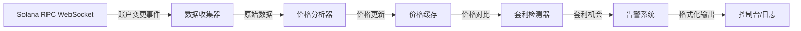

# Solana 套利 MVP

基于 Python 的 Solana 链下套利监控系统，实时监控 Solana DEX（Raydium 和 Orca）的流动性池价格，发现价格差异并提示套利机会。

## 功能特性

- 实时监控 Raydium 和 Orca 的流动性池价格
- 计算不同 DEX 之间的价格差异
- 检测并报告套利机会
- 动态监听热门交易对池子
- 支持可扩展到更多 DEX 协议

## 技术栈

- 编程语言: Python 3.9+
- Solana 交互: solana-py, solders
- 网络请求: httpx, websockets
- 数据处理: pandas, numpy
- 日志管理: loguru

## 系统架构

系统采用事件驱动架构，通过 WebSocket 实时接收链上数据，经过处理和分析后输出套利机会。



## 模块划分

- **数据收集器**: 负责 WebSocket 订阅和原始数据接收
- **池子管理器**: 管理监控的流动性池子列表
- **价格分析器**: 解析交易数据和计算实时价格
- **套利检测器**: 比较不同 DEX 价格，检测套利机会
- **告警系统**: 输出套利机会和告警
- **配置管理器**: 管理配置和参数

## 数据流



## 实现细节

### 核心目录结构

```
arbitrage-mvp/
├── src/
│   ├── collectors/       # 数据收集模块
│   │   └── ws_client.py  # WebSocket 客户端
│   ├── analyzers/        # 价格分析模块
│   │   └── price.py      # 价格计算逻辑
│   ├── detectors/        # 套利检测模块
│   │   └── arbitrage.py  # 套利机会检测
│   ├── models/           # 数据模型
│   │   ├── pool.py       # 流动性池模型
│   │   └── arbitrage.py  # 套利机会模型
│   ├── managers/         # 池子管理模块
│   │   └── pool_manager.py
│   ├── utils/            # 工具函数
│   │   ├── config.py     # 配置管理
│   │   └── helpers.py     # 辅助函数
│   ├── orchestrator.py   # 主程序编排器
│   ├── __init__.py     # src 包初始化文件
│   └── main.py           # 入口文件
├── config/
│   └── config.yaml       # 配置文件
├── logs/                 # 日志目录
├── main.py               # 项目入口点
└── pyproject.toml        # 依赖
```

### 关键代码结构

**LiquidityPool 接口**: 流动性池核心数据结构

```python
from dataclasses import dataclass
from typing import Optional
from solders.pubkey import Pubkey

@dataclass
class LiquidityPool:
    """流动性池数据模型"""
    address: Pubkey
    dex: str  # 'raydium' 或 'orca'
    token_a: Pubkey
    token_b: Pubkey
    reserve_a: int
    reserve_b: int
    last_update: float
```

**ArbitrageOpportunity 接口**: 套利机会数据结构

```python
@dataclass
class ArbitrageOpportunity:
    """套利机会数据模型"""
    token_pair: tuple[str, str]  # (token_a_address, token_b_address)
    buy_dex: str
    sell_dex: str
    buy_price: float
    sell_price: float
    price_diff_pct: float
    profit_estimate: float
    timestamp: float
```

## 技术实现方案

**1. 实时池子监听**

- 使用 solana-py 建立 WebSocket 连接
- 订阅 Raydium 和 Orca 流动性池账户变更
- 实现账户数据解码逻辑

**2. 价格计算与更新**

- 实现恒定乘积公式 (x * y = k) 计算价格
- 考虑交易手续费的影响
- 实现价格缓存机制

**3. 套利检测逻辑**

- 同一交易对在不同 DEX 的价格对比
- 计算价格差百分比
- 设置最小套利阈值过滤噪音

**4. 热门池子动态监听**

- 实现基于交易量的池子热度算法
- 动态添加/移除监控池子
- 支持白名单和黑名单配置

## 集成点

- **与 Solana 网络**: 使用 WebSocket 订阅账户变更 (JSON 格式)
- **与数据库**: PostgreSQL (连接池)
- **与前端**: RESTful API + WebSocket 推送 (JSON 格式)
- **外部依赖**: Solana RPC 节点（可能使用付费节点如 Helius）

## 技术考量

### 性能优化

- **连接池管理**: 复用 WebSocket 连接，避免频繁建立连接
- **价格缓存**: 使用 Redis 或内存缓存最新价格，减少计算开销
- **批量处理**: 对大量池子更新进行批量处理，提高吞吐量

### 安全措施

- **RPC 节点认证**: 使用 API Key 访问 Solana RPC
- **输入验证**: 验证所有来自外部的参数和地址
- **API 限流**: 防止 API 滥用

### 可扩展性

- **水平扩展**: 监听服务可多实例部署，通过消息队列分发任务
- **数据库分区**: 按时间分区存储价格历史数据
- **负载均衡**: API 服务支持水平扩展

## 安装

1. 使用 uv 安装依赖：

```bash
uv sync
```

或使用 pip：

```bash
pip install -r requirements.txt
```

## 配置

编辑 `config/config.yaml` 自定义：

- **RPC 端点**: Solana RPC 节点 URL
- **DEX 协议**: 监控的 DEX 列表（raydium, orca）
- **监控参数**: 最小流动性、利润阈值等
- **套利设置**: 交易大小、滑点容差
- **日志记录**: 日志级别和文件设置

## 使用方法

运行监控系统（推荐方式，使用 -m 模块导入）：

```bash
python -m src.main
```

**注意**：
- 使用 `-m` 标志告诉 Python 将 `src` 视为包名
- `src.main` 中的 `main` 是模块名
- 这种导入方式避免了相对导入的路径问题

其他方式（不推荐）：

```bash
# 直接运行（会报错，因为 src.main 使用相对导入）
python main.py

# 或使用 uv 运行
uv run python src.main
```

## 工作原理

1. **初始化**: 系统加载配置并初始化示例池子
2. **WebSocket 连接**: 连接到 Solana RPC via WebSocket
3. **账户订阅**: 订阅流动性池账户更新
4. **价格分析**: 使用恒定乘积公式计算价格（x * y = k）
5. **套利检测**: 比较 DEX 间价格，发现机会
6. **告警**: 打印检测到的机会及利润估算

## 架构

系统采用事件驱动架构：

- **数据收集器**: 从 Solana 网络接收实时数据
- **分析器**: 处理数据并计算价格
- **检测器**: 识别套利机会
- **管理器**: 维护池子状态和订阅

## 数据模型

- **LiquidityPool** - 带有储备金和价格计算的流动性池
- **ArbitrageOpportunity** - 带有利润估算的检测到的套利机会

## 开发

### 添加新 DEX 支持

1. 在 `ws_client.py` 中实现池子数据解析
2. 在 `config.yaml` 中添加 DEX 特定配置
3. 更新 `orchestrator.py` 中的 `initialize_sample_pools()`

### 扩展三角套利

1. 创建三角套利检测器
2. 实现基于图的路径查找
3. 添加多跳交易估算

## 注意事项

- 这是一个 MVP 用于演示目的
- 代码中的池子地址为占位符，生产环境需从 DEX API 或链上数据获取真实地址
- 建议使用专用 RPC 节点以获得更好的稳定性和性能
- 系统已完成 MVP 实现，后续可扩展三角套利、交易执行等功能

## 故障排除

### ImportError: No module named 'src'

**问题描述**：使用 `from src.orchestrator import` 时报错

**原因**：Python 将 `src` 视为包名，而不是相对路径

**解决方案**：
1. **推荐方式**：使用 `python -m src.main` 启动
   - `-m` 标志告诉 Python 将 `src` 作为包名处理
   - `src.main` 中的 `main` 是模块名
   
2. **根目录 main.py**：已更新根目录的 `main.py`
   - 使用 `-m src.main` 导入方式
   - 正确配置 sys.path

## 许可证

MIT
